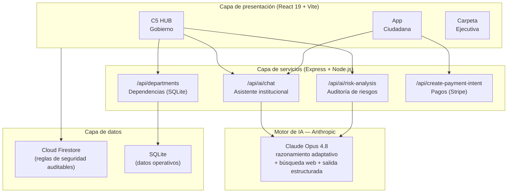

# Nayarit Digital

**Plataforma de Gobernanza Digital del Municipio de Tepic, Nayarit, México**

Infraestructura institucional de servicios digitales que integra trámites, pagos, reportes ciudadanos, salud preventiva y transparencia en un solo ecosistema — impulsada por inteligencia artificial de **Anthropic (Claude)**.

---

## Visión

> "La digitalización municipal basada en interoperabilidad, inclusión y datos abiertos incrementa simultáneamente la recaudación, la eficiencia administrativa y la confianza ciudadana."

Nayarit Digital no es un conjunto de aplicaciones: es el **sistema operativo municipal** de Tepic. Una sola cuenta ciudadana (CURP o teléfono) da acceso a todos los servicios, y cada interacción alimenta el Observatorio Digital con datos abiertos y anonimizados.

## Módulos del ecosistema

| Módulo | Función | Componentes clave |
| :--- | :--- | :--- |
| **C5 HUB Gobierno** | Centro de inteligencia para funcionarios: tableros, mando central, auditoría | `C5Dashboard`, `MandoCentral`, `SystemAuditView` |
| **Experiencia Ciudadana (RUTA)** | App ciudadana: trámites, pagos, reportes, credencial digital | `CitizenApp`, `CitizenOS`, `CredentialScannerView` |
| **Tesorería Digital** | Pago de predial, agua, multas y licencias en línea (Stripe) | `CanjesView`, integración Stripe |
| **Salud Nayarit ID** | Triaje y orientación médica con IA | `SaludNayaritID` |
| **Trazabilidad territorial** | Mapas de obras, reportes urbanos y cobertura | `NayaritMap`, `SovereignMap`, `UrbanReportMapView` |
| **Parlamento y análisis político** | Seguimiento legislativo y análisis estratégico | `ParlamentoView`, `AnalisisPoliticoView` |
| **Academia ConnectX** | Capacitación del servidor público | `ConnectXAcademy`, `StrategicAcademyView` |
| **Carpeta Ejecutiva** | Documentación estratégica para la Presidencia Municipal | `ExecutiveFolder`, `Whitepaper`, `MasterStrategicPlan` |

## Arquitectura



**Principio de seguridad central:** las credenciales del motor de IA viven **exclusivamente en el servidor**. El navegador del ciudadano nunca recibe llaves de API — toda inferencia pasa por endpoints controlados y auditables.

## Motor de inteligencia artificial

| Capacidad | Implementación |
| :--- | :--- |
| **Asistente institucional** | Claude Opus 4.8 (`claude-opus-4-8`) con prompt de sistema institucional |
| **Razonamiento profundo** | Pensamiento adaptativo (`thinking: adaptive`) con esfuerzo alto para consultas complejas |
| **Información actualizada** | Búsqueda web con contexto geográfico de Tepic, Nayarit |
| **Auditoría de riesgos** | Salida estructurada (JSON Schema estricto) — resultados siempre válidos y verificables |
| **Multilingüe** | Español, con hoja de ruta hacia wixárika y cora |

## Stack tecnológico

| Capa | Tecnología |
| :--- | :--- |
| Frontend | React 19, TypeScript, Vite 6, Tailwind CSS 4, Motion, Recharts |
| Backend | Node.js, Express, better-sqlite3 |
| IA | Anthropic Claude (`@anthropic-ai/sdk`) |
| Datos en la nube | Firebase / Cloud Firestore (reglas en `firestore.rules`) |
| Pagos | Stripe (MXN) |
| Geoespacial | Google Maps Platform |
| OCR / credenciales | Tesseract.js, html5-qrcode, jsbarcode |

## Ejecución local

**Prerrequisitos:** Node.js 20+

```bash
# 1. Instalar dependencias
npm install

# 2. Configurar variables de entorno
cp .env.example .env.local
#    → añadir ANTHROPIC_API_KEY (y opcionalmente Stripe / Google Maps)

# 3. Iniciar en desarrollo
npm run dev            # http://localhost:3000

# Verificación de tipos
npm run lint

# Build de producción
npm run build && npm start
```

## Seguridad y cumplimiento

- **Reglas de Firestore** (`firestore.rules`): control de acceso por rol y colección.
- **Credenciales de IA solo en servidor**: sin exposición de llaves en el bundle del cliente.
- **Marco normativo**: LGPDP / LFPDPPP (protección de datos), Ley General de Transparencia (datos abiertos), lineamientos de IA confiable (ISO/IEC 42001).
- **Trazabilidad**: registros de auditoría inmutables analizados por el módulo de riesgos.

Detalle completo en [`docs/ARQUITECTURA.md`](docs/ARQUITECTURA.md).

## Documentación

| Documento | Contenido |
| :--- | :--- |
| [`docs/ARQUITECTURA.md`](docs/ARQUITECTURA.md) | Arquitectura técnica de referencia (para Dirección de Informática y Contraloría) |
| [`public/NAYARIT_DIGITAL_V2.md`](public/NAYARIT_DIGITAL_V2.md) | Propuesta de política pública y modelo de datos (versión 2.0) |
| [`Parlamento.MD`](Parlamento.MD) | Módulo de seguimiento legislativo |

---

**Municipio de Tepic, Nayarit — México** · Desarrollado por ConnectX · Motor de IA: Anthropic Claude
