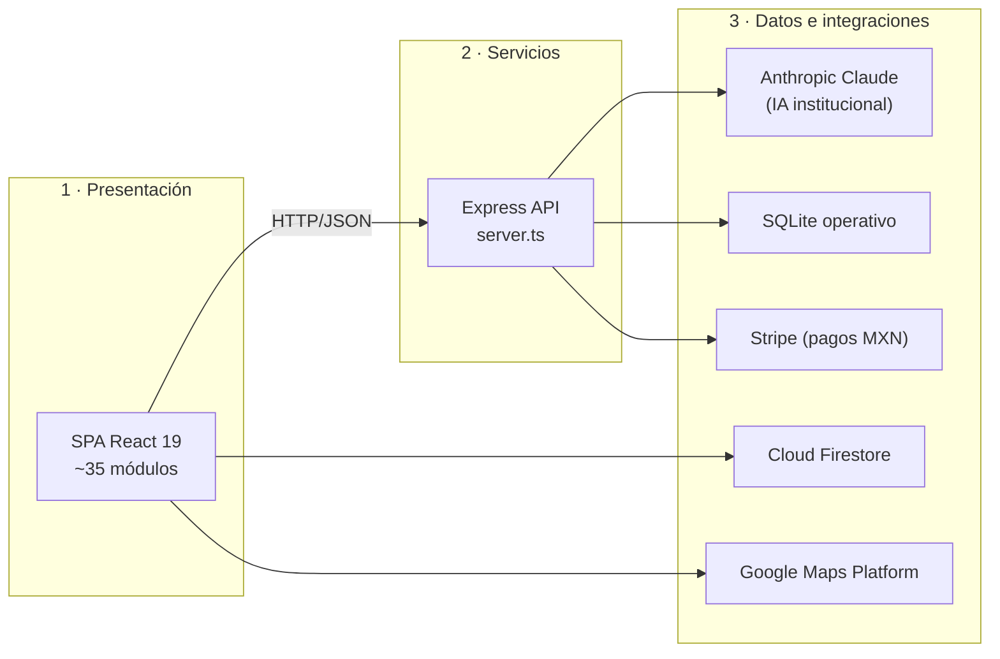
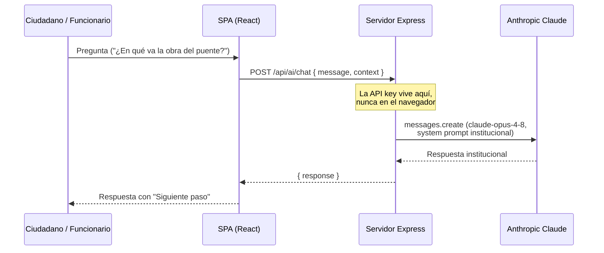

# Arquitectura Técnica de Referencia — Nayarit Digital

**Versión 2.0 · Municipio de Tepic, Nayarit, México**
*Audiencia: Dirección de Informática Municipal, Contraloría, evaluadores técnicos y licitadores.*

---

## 1. Resumen ejecutivo

Nayarit Digital es una plataforma web de gobernanza digital construida sobre una arquitectura de tres capas (presentación, servicios, datos) con un **motor de inteligencia artificial institucional operado por Anthropic (Claude)**. El diseño prioriza tres garantías verificables:

1. **Soberanía de credenciales** — ninguna llave de API sale del servidor municipal.
2. **Salidas de IA verificables** — los análisis automatizados se emiten bajo contrato de esquema estricto (JSON Schema), lo que los hace auditables y reproducibles.
3. **Trazabilidad** — cada operación administrativa genera registro de auditoría analizable.

## 2. Vista de capas



| Capa | Tecnología | Responsabilidad |
| :--- | :--- | :--- |
| Presentación | React 19 + TypeScript + Vite 6 + Tailwind 4 | Interfaces para gobierno (C5), ciudadanía (RUTA) y ejecutivo |
| Servicios | Express (Node.js), `server.ts` | Endpoints de IA, dependencias, pagos; custodia de credenciales |
| Datos | Firestore + SQLite | Firestore para interoperabilidad en tiempo real; SQLite para catálogo operativo |

## 3. Motor de IA — decisiones de diseño

### 3.1 Modelo

El modelo institucional es **Claude Opus 4.8** (`claude-opus-4-8`) de Anthropic, seleccionado por su capacidad de razonamiento en tareas de análisis administrativo y su desempeño multilingüe. La constante `CLAUDE_MODEL` en `server.ts` centraliza la elección, permitiendo escalar a modelos superiores (p. ej. Claude Fable 5) o descender a modelos de menor costo (Claude Sonnet 5 / Haiku 4.5) por endpoint según la carga.

### 3.2 Endpoints de IA

| Endpoint | Uso | Configuración |
| :--- | :--- | :--- |
| `POST /api/ai/chat` | Asistente institucional (C5, App Ciudadana, Salud) | Prompt de sistema institucional (`public/CONNECTX_SYSTEM_PROMPT.md`); pensamiento adaptativo con esfuerzo alto cuando `useThinking`; búsqueda web geolocalizada en Tepic cuando `useSearch`/`useMaps` |
| `POST /api/ai/risk-analysis` | Auditoría de riesgos de gobernanza (Mando Central) | Salida estructurada con JSON Schema estricto (9 campos obligatorios, `additionalProperties: false`); pensamiento adaptativo |

### 3.3 Contrato de salida del análisis de riesgos

El análisis de riesgos **no puede** devolver datos malformados: el esquema estricto garantiza la estructura. Campos:

| Campo | Tipo | Semántica |
| :--- | :--- | :--- |
| `score` | número 0–100 | Riesgo global (100 = crítico) |
| `level` | enum | `LOW` · `MEDIUM` · `HIGH` · `CRITICAL` |
| `findings` | lista | Hallazgos estratégicos |
| `recommendations` | lista | Acciones tácticas para funcionarios |
| `anomaliesDetected` | booleano | Detección de patrones anómalos en logs |
| `summary` | texto | Resumen ejecutivo |
| `strategicOutlook` | texto | Proyección de largo plazo |
| `sovereigntyIndex` | número 0–100 | Índice de Soberanía Digital |
| `governanceMaturity` | enum | `INITIAL` · `DEVELOPING` · `OPTIMIZED` · `ELITE` |

### 3.4 Flujo de una consulta ciudadana



## 4. Seguridad

| Control | Implementación | Verificación |
| :--- | :--- | :--- |
| Custodia de credenciales | `ANTHROPIC_API_KEY` solo en entorno del servidor; `vite.config.ts` no inyecta llaves de IA al bundle | Inspección del bundle de producción |
| Control de acceso a datos | `firestore.rules` con validación por rol y colección | Simulador de reglas de Firebase / auditoría |
| Pagos | Stripe con `clientSecret` efímero por transacción; llave secreta solo en servidor | PCI-DSS delegado a Stripe |
| Validación de salidas de IA | JSON Schema estricto en análisis de riesgos | Contrato tipado compartido (`RiskAnalysisResult`) |
| Registro de auditoría | Logs inmutables por dependencia, analizados por el módulo de riesgos | `SystemAuditView` + `MandoCentral` |

## 5. Cumplimiento normativo

- **LGPDP / LFPDPPP** — el Municipio de Tepic es propietario de los datos; el procesador tecnológico actúa como encargado del tratamiento bajo contrato.
- **Ley General de Transparencia** — los indicadores agregados y anonimizados son públicos por diseño (Observatorio Digital).
- **ISO/IEC 42001 (IA confiable)** — el asistente opera con supervisión humana, prompt de sistema versionado en repositorio (`public/CONNECTX_SYSTEM_PROMPT.md`) y salidas estructuradas explicables.
- **Datos sensibles de salud** — tratamiento diferenciado con anonimización (ver política de conservación en `public/NAYARIT_DIGITAL_V2.md`, §2.2).

## 6. Escalabilidad y evolución

| Horizonte | Evolución técnica |
| :--- | :--- |
| Corto plazo | Streaming de respuestas del asistente (SSE) para latencia percibida menor; caché de prompt para reducir costo por token |
| Mediano plazo | Clasificación automática de reportes ciudadanos con Claude Haiku 4.5 (alto volumen, bajo costo); triaje de salud con salida estructurada |
| Largo plazo | Agentes de análisis territorial de largo aliento (Claude Fable 5 / Opus) alimentando el Observatorio Digital de Nayarit |

## 7. Estructura del repositorio

```
├── server.ts                  # API Express + motor de IA (Anthropic)
├── src/
│   ├── App.tsx                # Enrutador de vistas (landing / C5 / ciudadano / ejecutivo)
│   ├── components/            # ~35 módulos de interfaz
│   │   └── dashboard/         # Vistas analíticas (Parlamento, Roadmap, Análisis)
│   ├── services/              # aiRiskService, citizenService, departmentService, infrastructureService
│   └── firebase.ts            # Inicialización de Firestore
├── public/                    # Prompts de sistema y documentos de política pública
├── docs/                      # Esta documentación
├── firestore.rules            # Reglas de seguridad de datos
└── firebase-blueprint.json    # Plano de colecciones Firestore
```

---

*Documento mantenido junto al código. Cualquier cambio de arquitectura debe reflejarse aquí en el mismo pull request.*
