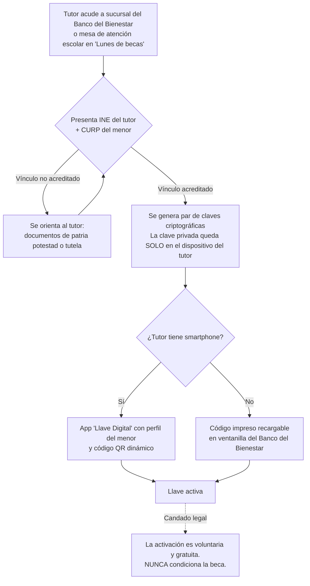
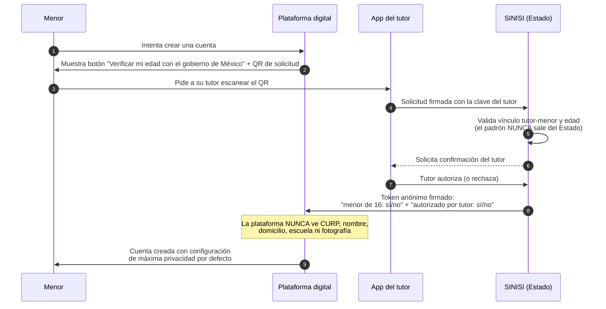
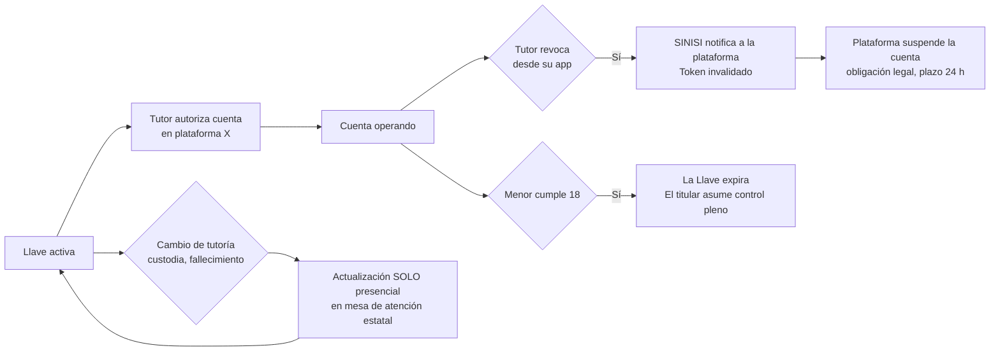
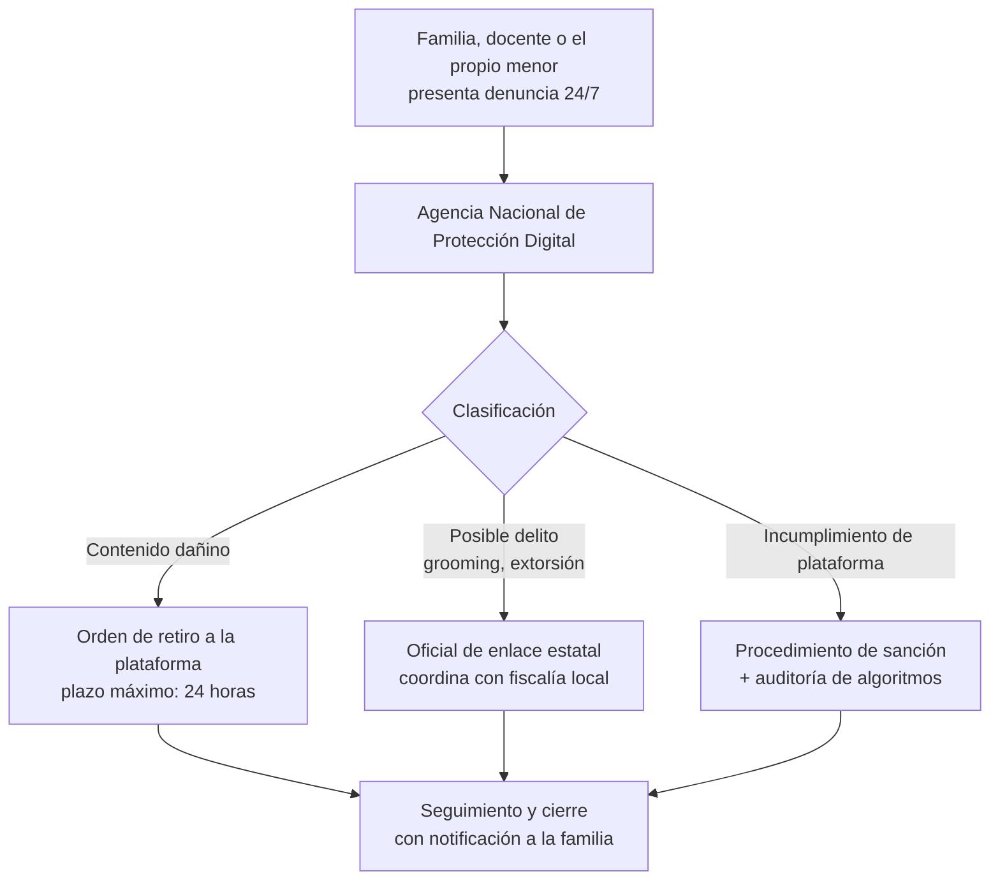

# Diagramas de flujo — Llave Digital de Protección a la Niñez (IDBJ)

Diagramas para presentar a autoridades. Renderizan directamente en GitHub
(Mermaid).

## 1. Activación de la Llave (una sola vez, presencial)

## 2. Verificación de edad ante una plataforma (doble anonimato)

## 3. Revocación y ciclo de vida del consentimiento

## 4. Denuncia 24/7 (Agencia Nacional de Protección Digital)

