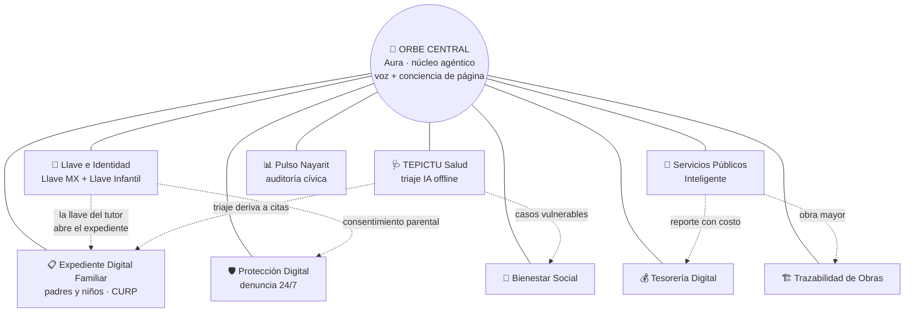

# Orbe Central — Mapa modular del ecosistema

**Nayarit Digital / ConnectX / SOATM** · Núcleo de inteligencia y gobernanza agéntica

> Regla de oro de este directorio: **un círculo = un módulo = un archivo.**
> Para editar un módulo (su alcance, su estado, sus integraciones) se edita
> únicamente su archivo en [`modulos/`](./modulos/). El registro
> [`modulos.json`](./modulos.json) es el índice legible por máquina que la
> aplicación y los agentes pueden consumir.

## Dos versiones de este mapa

- **`orbe.html`** (este directorio): demo estática autocontenida, sin
  backend ni login — sirve para pitch/presentación offline. Su chat es un
  enrutador por palabras clave, no IA real.
- **`/orbe` dentro de la app** ([`src/components/OrbeCentral.tsx`](../../src/components/OrbeCentral.tsx),
  datos en [`src/data/orbeModulos.ts`](../../src/data/orbeModulos.ts)): la
  versión real, con el agente Aura conectado de verdad (Gemini vía
  `useAuraChat`/`useAuraVoice`) — atención ciudadana en texto y voz, 24/7, y
  un "Modo desarrollador" para ver archivos/pendientes de cada módulo y
  generar el prompt de edición. Es la que se usa en producción.

## El Orbe

- **Línea sólida** = el módulo vive en el Orbe (misma cuenta ciudadana, mismo
  núcleo agéntico).
- **Línea punteada** = flujo de datos/eventos entre módulos (siempre a través
  del núcleo, nunca directo entre bases de datos).

## Los círculos

| Módulo | Archivo | Estado |
|---|---|---|
| Orbe Central (Aura, núcleo agéntico) | [`modulos/ORBE_NUCLEO.md`](./modulos/ORBE_NUCLEO.md) | En construcción |
| Llave e Identidad (Llave MX + Llave Infantil) | [`modulos/LLAVE_IDENTIDAD.md`](./modulos/LLAVE_IDENTIDAD.md) | Propuesta aterrizada |
| Expediente Digital Familiar (padres y niños) | [`modulos/EXPEDIENTE_FAMILIAR.md`](./modulos/EXPEDIENTE_FAMILIAR.md) | Piloto Tepic funcionando |
| TEPICTU Salud (triaje IA) | [`modulos/TEPICTU_SALUD.md`](./modulos/TEPICTU_SALUD.md) | Diseñado |
| Tesorería Digital | [`modulos/TESORERIA.md`](./modulos/TESORERIA.md) | Diseñado |
| Trazabilidad de Obras | [`modulos/OBRAS.md`](./modulos/OBRAS.md) | Diseñado |
| Servicios Públicos Inteligente | [`modulos/SERVICIOS_PUBLICOS.md`](./modulos/SERVICIOS_PUBLICOS.md) | Diseñado |
| Bienestar Social | [`modulos/BIENESTAR.md`](./modulos/BIENESTAR.md) | Diseñado |
| Pulso Nayarit (auditoría cívica) | [`modulos/PULSO_NAYARIT.md`](./modulos/PULSO_NAYARIT.md) | Backend desplegado |
| Protección Digital (denuncia 24/7) | [`modulos/PROTECCION_DIGITAL.md`](./modulos/PROTECCION_DIGITAL.md) | Propuesta aterrizada |

## Cómo editar un módulo (el flujo)

1. Abre **solo** el archivo del módulo en `modulos/`.
2. Cada archivo sigue la misma plantilla de 6 secciones — no agregues
   secciones nuevas sin actualizar la plantilla para todos:
   - **Qué es** (2-3 líneas)
   - **Estado** (Diseñado / En construcción / Piloto / Producción)
   - **Conexiones** (con qué círculos habla y qué evento fluye)
   - **Dónde vive** (docs y código fuente reales, con rutas)
   - **Cómo editarlo** (qué archivos tocar para cada tipo de cambio)
   - **Pendientes**
3. Si el cambio altera nombre, estado o conexiones, refleja lo mismo en
   [`modulos.json`](./modulos.json) y en el diagrama de este README.
4. Un PR por módulo siempre que sea posible: cambios acotados, revisión fácil.

## Principios del Orbe

1. **El núcleo orquesta, no almacena**: los datos viven en cada módulo; el
   Orbe enruta eventos y conversación (Aura).
2. **La llave del tutor es transversal**: cualquier módulo que toque datos de
   un menor consume el consentimiento del círculo Llave e Identidad — nunca
   implementa el suyo propio.
3. **Separación de bases con candado**: verificación de edad y expediente
   médico jamás comparten base de datos; comparten llave, no datos.
4. **Estándar abierto**: congruente con `docs/marco/ESTRATEGIA_ESTANDAR_ABIERTO.md`.
