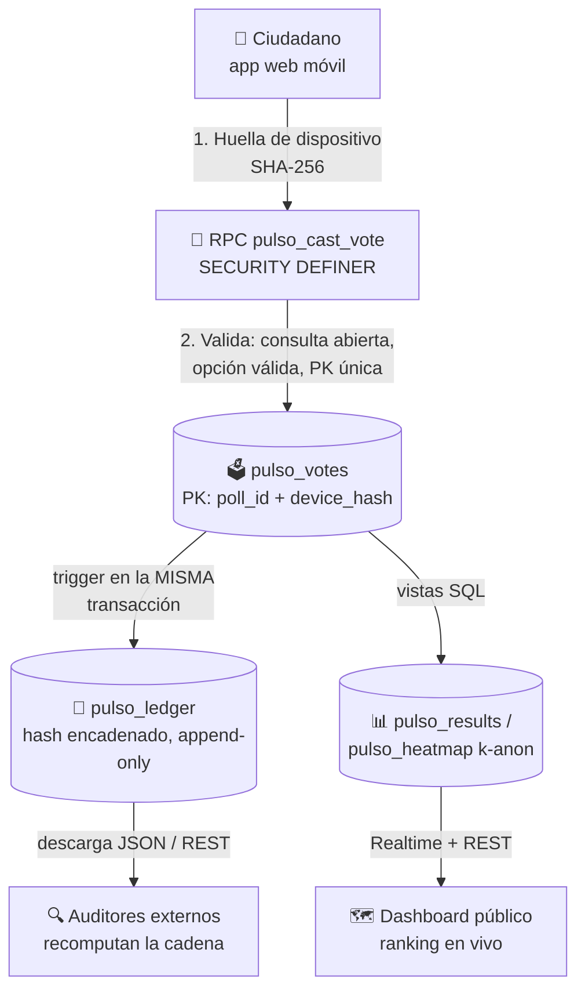

# 🗳️ Pulso Nayarit — Auditoría Cívica Open Source

> **Un dispositivo = Un voto. Datos públicos, anonimizados y auditables por cualquier ciudadano.**

**Pulso Nayarit** es una plataforma de participación ciudadana en tiempo real que mide la preferencia electoral de forma **neutral, verificable y de código abierto**. Cada opinión emitida queda registrada en un libro mayor abierto (*Open Ledger*) encadenado criptográficamente que cualquier persona puede descargar, verificar y replicar — sin cajas negras, sin encuestadoras opacas, sin cifras a modo.

> ⚠️ **Aviso importante:** Pulso Nayarit es un **ejercicio ciudadano de opinión**, independiente y sin afiliación partidista. **No** forma parte del proceso electoral oficial ni sustituye a las autoridades electorales (INE / IEEN). La consulta activa es una **demo con datos de prueba**.

---

## 📐 Estructura del Repositorio

```
pulso-nayarit/
├── README.md                        # Este documento — visión, features e instalación
├── ARCHITECTURE.md                  # Justificación técnica: Supabase vs Firebase, escala, límites
├── frontend/
│   └── index.html                   # Dashboard conectado en vivo (supabase-js + Realtime)
├── ledger/
│   └── SCHEMA.md                    # Modelo de datos explicado (tablas, invariantes, privacidad)
└── supabase/
    ├── README.md                    # Estado del despliegue + consulta de auditoría de la cadena
    └── migrations/
        ├── 0001_pulso_ledger.sql    # Esquema completo: tablas, RLS, triggers, RPC, vistas
        ├── 0002_seed_demo.sql       # Consulta demo + votos de prueba (no usar en producción)
        ├── 0003_hardening.sql       # Endurecimiento tras los security advisors
        └── 0004_review_fixes.sql    # Ventana de votación, guardias TRUNCATE, k-anon por celda
```

El módulo vive dentro del monorepo [Gobernanza Digital](../README.md) pero su backend es **Supabase/Postgres**, elegido deliberadamente sobre el Firebase del monorepo — el análisis completo está en [`ARCHITECTURE.md`](./ARCHITECTURE.md#2-decisión-de-stack-por-qué-supabasepostgres-y-no-firebase).

---

## ⚡ Features Técnicos

| Feature | Implementación |
|---|---|
| 🔒 **Un dispositivo = Un voto** | `PRIMARY KEY (poll_id, device_hash)` en Postgres: la segunda inserción del mismo dispositivo falla en la capa de almacenamiento — no hay código de aplicación que saltarse. |
| 📖 **Open Ledger auditable** | Trigger en la **misma transacción** del voto anexa un registro con hash SHA-256 encadenado (`prev_hash`). Alterar la historia rompe la cadena y es públicamente detectable. |
| 🛡️ **Append-only real** | Triggers de inmutabilidad rechazan `UPDATE`/`DELETE`/`TRUNCATE`, y los roles de la API (incluido `service_role`) tienen revocada la escritura directa — la única vía es la RPC (verificado en despliegue). |
| 🗺️ **Geolocalización con privacidad** | Solo código postal, timestamps redondeados a la hora, y supresión k-anónima doble (k=5, por CP y por celda) en la vista del mapa de calor. Los votos individuales no son consultables. |
| 📊 **Resultados en tiempo real** | Supabase Realtime: cada inserción en el ledger refresca el ranking del dashboard sin recargar. |
| 🧾 **Datos crudos con un clic** | El botón "Ver Datos Crudos" descarga el ledger completo en JSON; también está expuesto como API REST pública de solo lectura (PostgREST). |
| 📱 **Móvil-first, cero fricción** | Página estática servida desde CDN con la clave publicable: sin servidor de aplicación, sin registro con datos personales. |

---

## 🏗️ Arquitectura



**Flujo en 4 pasos:**

1. **Huella** — el dispositivo genera su hash SHA-256 (prototipo: identificador persistido; roadmap: OTP por SMS con Supabase Auth).
2. **Emisión** — la RPC `pulso_cast_vote` valida e inserta; la clave primaria garantiza que la segunda emisión del mismo dispositivo falle.
3. **Registro** — un trigger encadena el voto al ledger público dentro de la misma transacción: es imposible que un voto quede fuera de la cadena.
4. **Publicación** — vistas agregadas (con k-anonimato) alimentan el dashboard vía Realtime; el ledger completo queda disponible para descarga y recomputación.

Detalles en [`ARCHITECTURE.md`](./ARCHITECTURE.md), modelo de datos en [`ledger/SCHEMA.md`](./ledger/SCHEMA.md) y verificación del despliegue en [`supabase/README.md`](./supabase/README.md).

---

## 🚀 Instalación Rápida

### Ver el dashboard (ya conectado al backend desplegado)

```bash
git clone https://github.com/Autosociomx/gobernanza-digital-.git
cd gobernanza-digital-/pulso-nayarit/frontend

npx serve .
# → abre http://localhost:3000 — ranking en vivo, emisión de voto y descarga del ledger
```

### Replicar el backend en tu propio proyecto Supabase

```bash
# Con el CLI de Supabase apuntando a tu proyecto:
supabase db push --include-all   # aplica supabase/migrations/ en orden

# O pega las migraciones en el SQL Editor del dashboard de Supabase.
# Después actualiza SUPABASE_URL y SUPABASE_KEY en frontend/index.html.
```

### Auditar la cadena de hashes

La consulta SQL de verificación (la misma que corrió en el despliegue: 42/42 registros válidos) está en [`supabase/README.md`](./supabase/README.md).

---

## 🧭 Estado del Proyecto

| Componente | Estado |
|---|---|
| Esquema Postgres (tablas, RLS, triggers, RPC, vistas) | ✅ Desplegado y verificado |
| Dashboard conectado (ranking en vivo, voto real, descarga del ledger) | ✅ Funcionando |
| Consulta demo con datos de prueba | ✅ Activa (`Gubernatura 2027 (Demo)`) |
| Atestación fuerte de dispositivo (OTP SMS / biometría) | 🔜 Roadmap |
| Mapa de calor conectado a `pulso_heatmap` | 🔜 Roadmap (hoy es decorativo) |
| Proyecto Supabase dedicado | 🔜 Al liberar un slot del plan |

## 🤝 Contribuir

La neutralidad del sistema depende de que el código sea revisado por muchos ojos. Issues y PRs bienvenidos — especialmente auditorías al esquema del ledger y al mecanismo de unicidad de dispositivo.

## 📄 Licencia

Código abierto bajo la licencia del monorepo Gobernanza Digital.
