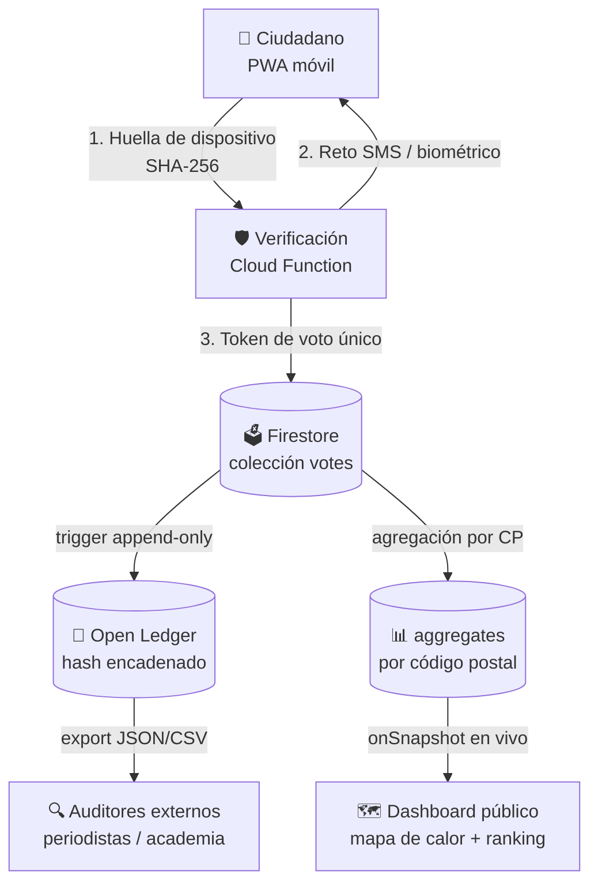

# 🗳️ Pulso Nayarit — Auditoría Cívica Open Source

> **Un dispositivo = Un voto. Datos públicos, anonimizados y auditables por cualquier ciudadano.**

**Pulso Nayarit** es una plataforma de participación ciudadana en tiempo real que mide la preferencia electoral de forma **neutral, verificable y de código abierto**. Cada opinión emitida queda registrada en un libro mayor abierto (*Open Ledger*) que cualquier persona puede descargar, verificar y replicar — sin cajas negras, sin encuestadoras opacas, sin cifras a modo.

> ⚠️ **Aviso importante:** Pulso Nayarit es un **ejercicio ciudadano de opinión**, independiente y sin afiliación partidista. **No** forma parte del proceso electoral oficial ni sustituye a las autoridades electorales (INE / IEEN). El dashboard incluido en este módulo es un **prototipo con datos 100% simulados**.

---

## 📐 Estructura del Repositorio

```
pulso-nayarit/
├── README.md               # Este documento — visión, features e instalación
├── ARCHITECTURE.md         # Justificación técnica y diseño para escala
├── frontend/               # Capa de presentación (PWA móvil-first)
│   └── index.html          # Dashboard: mapa de calor, ranking en vivo, flujo de voto
└── ledger/                 # Modelo de datos del libro mayor auditable
    └── SCHEMA.md           # Colecciones, hashing de dispositivo y agregación geográfica
```

El módulo vive dentro del monorepo [Gobernanza Digital](../README.md) y reutiliza su infraestructura (Firebase Auth, Firestore, reglas de seguridad y despliegue en Netlify).

---

## ⚡ Features Técnicos

| Feature | Descripción |
|---|---|
| 🔒 **Un dispositivo = Un voto** | Huella criptográfica del dispositivo (hash SHA-256 de señales del equipo + verificación SMS/biométrica) para neutralizar granjas de bots sin almacenar datos personales. |
| 📖 **Open Ledger auditable** | Cada voto genera un registro *append-only* con hash encadenado. Cualquier ciudadano puede descargar el ledger completo y recomputar los totales. |
| 🗺️ **Geolocalización con privacidad** | La ubicación se agrega por **código postal**, nunca por coordenadas exactas. El mapa de calor muestra tendencias, no personas. |
| 📊 **Resultados en tiempo real** | Suscripciones en vivo (Firestore `onSnapshot`) actualizan el ranking y el mapa de calor sin recargar la página. |
| 🧾 **Datos crudos con un clic** | El botón "Ver Datos Crudos" expone el dataset anonimizado en formato abierto (JSON/CSV) para periodistas, académicos y auditores. |
| 📱 **Móvil-first, cero fricción** | PWA estática servida desde CDN: sin instalación, sin registro con datos personales, funciona en gama baja con 3G. |

---

## 🏗️ Arquitectura



**Flujo en 4 pasos:**

1. **Verificación** — el dispositivo genera una huella criptográfica; una Cloud Function valida unicidad y dispara un reto SMS/biométrico.
2. **Emisión** — el voto se escribe una sola vez (regla de seguridad: el hash de dispositivo es la clave del documento; una segunda escritura es rechazada).
3. **Registro** — un trigger *append-only* encadena el voto al ledger público con el hash del registro anterior.
4. **Publicación** — los agregados por código postal alimentan el mapa de calor y el ranking en tiempo real; el ledger completo queda disponible para descarga.

Detalles completos en [`ARCHITECTURE.md`](./ARCHITECTURE.md) y el modelo de datos en [`ledger/SCHEMA.md`](./ledger/SCHEMA.md).

---

## 🚀 Instalación Rápida

### Prototipo (solo frontend, datos simulados)

No requiere backend ni dependencias:

```bash
git clone https://github.com/Autosociomx/gobernanza-digital-.git
cd gobernanza-digital-/pulso-nayarit/frontend

# Sirve el dashboard localmente
npx serve .
# → abre http://localhost:3000
```

### Integración con el monorepo (Firebase)

```bash
# Desde la raíz del monorepo
npm install
cp .env.example .env        # configura tus credenciales de Firebase
npm run dev
```

Las reglas de seguridad del módulo se despliegan junto con las del monorepo (`firestore.rules`).

---

## 🧭 Estado del Proyecto

| Componente | Estado |
|---|---|
| Dashboard móvil (frontend) | ✅ Prototipo funcional (datos simulados) |
| Modelo de datos del ledger | 📝 Especificado (`ledger/SCHEMA.md`) |
| Verificación de dispositivo (Cloud Function) | 🔜 Planeado |
| Export de datos crudos (JSON/CSV) | 🔜 Planeado |

## 🤝 Contribuir

La neutralidad del sistema depende de que el código sea revisado por muchos ojos. Issues y PRs bienvenidos — especialmente auditorías al esquema del ledger y al mecanismo de unicidad de dispositivo.

## 📄 Licencia

Código abierto bajo la licencia del monorepo Gobernanza Digital.
